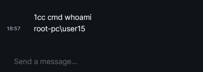

  
  <h1>goZulipC2</h1>
   

<i>goMatrixC2 is a Remote Access Tool that uses <a href="https://matrix.org/">Zulip</a> as a Command and Control server for communicating with your implant. Created by <a href="https://twitter.com/n1k7l4i">@n1k7l4i</a>.</i>

 

   
   
  

### Synopsis

goMatrixC2 is a remote access tool that uses the Matrix Client API to establish a covert communication channel with a chat room and execute commands from an operator. The operator can use the chat room as a command and control center to manipulate the target system in various ways, such as:

- Running commands using command prompt or PowerShell, similar to a reverse shell. Capturing screenshots from the target system and uploading them to the chat room. Transferring files between the target system and any location on the operator’s system.Managing processes, files, directories, network adapters, DNS cache, EDR drivers, and more on the target system. And much more!

> ⚠️ goMatrixC2 is also open to contributions and suggestions, so feel free to fork it, star it, or open an issue if you have any feedback.

### Quick Start

> Please refer to the [WIKI](https://n1k7l4i.github.io/posts/zulip-c2-0/) for guide through on setup.

### Usage & Args

> Remember to use the Agent ID before any of the commands! Ex: xyz cmd whoami

- cmd <arguments>: Executes a command prompt similar to a reverse shell.
- pwsh <arguments>: Executes a PowerShell prompt similar to a reverse shell.
- screenshot: Takes a screenshot and uploads it to the Command and Control (C2) server.
- download <file/directory>: Uploads the specified file as a singular file or as a singular archive in case of a directory.
- upload <download_link> -d <download_path>: Downloads the file and stores it in the temporary directory. If the -d flag is not used, it will be stored in the temporary directory.
- proclist: Retrieves and displays all running processes as a table.
- pwd: Displays the current working directory.
- dir <target_path>: Lists the files and directories in the specified target directory.
- cp <target_path> <new_path>: Copies a file or folder from the target location to a new specified location.
- remove <target_path>: Deletes the specified target file or directory.
- mkdir <target_path> <newdir_name>: Creates a new directory with the specified name in the given target path.
- cat <target_file>: Reads and displays the content of the specified target file, similar to the cat command in Linux.
- arp: Lists out the Address Resolution Protocol (ARP) table.
- edrsigs: Matches a list of Endpoint Detection and Response (EDR) drivers with the currently installed drivers on the system.
- ipconfig: Lists out network adapters, IP addresses assigned to each adapter, subnet masks, default gateways, and DNS servers.
- listdns: Lists out the DNS cache entries.
- locale: Lists out the locale information of the system.
- netstat: Lists out the active and established IPv4, UDP, and TCP connections.
- resources: Lists out information on disk drives and physical memory.
- routeprint: Lists out the IPv4 routes.
- uptime: Retrieves the uptime of the system.
- listwindows: Lists out all the window names that are visible to the user.
- uninstall: Removes itself from the system.

### End

If you encounter any issues or have suggestions, please open an issue on GitHub or contact me on Twitter at [@n1k7l4i](https://twitter.com/n1k7l4i). Your feedback helps improve this project.
